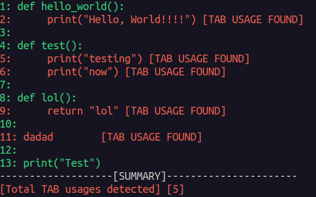

# DetectTabs
Simple command line python script to detect TABs usage in a file, with option to replace the usage of TABS with spaces

## Description
Main goal of this python script, when provided with a file, to analyze the content of the file and detect if TABs (tabulation) was used instead of spaces.
For example:
you provide the file "john_doe.txt" which is 10 lines long file and there is a TABs usage on line 3 and 5. The script have two options: check and replace.
* the 'check' argument scan the files and report the lines and the content on the line where is used TABs instead of spaces.
There is also check-short which option which print only the line number with less details
* The 'replace' argument opens and scan the file for TABs usage, if found any then generate a new file called <"filename_tabs_removed"> where TABs usage is replace with spaces

### How to execute and example usages:
### Usage with check argument
### Provided check argument which return all lines of the provided file and if there is any TABs usage on certain line, the TABs usage is reported detailed
```
python3 detect_tabs.py <filename> check
```

### Usage with check-short argument
### Provided check-short argument which return all lines of the provided file if any TABs usage is encountered, but it display only the line number without the content of the line.
```
python3 detect_tabs.py <filename> check-short
```

### Usage with replace argument (not a python file)
### Provided replace argument for file different than python. It goes trough the file and if there is any TABs usages, they are replaced with spaces (1 tab = 8 spaces). The new content is outputed to "<filename_tabs_removed>"file

```
python3 detect_tabs.py <filename> replace
```

### Usage with replace argument (python file)
### Provided replace argument for python file. It goes trough the file and if there is any TABs usages, they are replaced with spaces (1 tab = 4 spaces, PEP8). The new content is outputed to "<filename_tabs_removed>"file

```
python3 detect_tabs.py <filename> <10> replace
```

### Usage with replace argument and custom space to TABS conversion (integer number)
### Provided replace argument for file with optional argument for number (1 tab = provided number of spaces). It goes trough the file and if there is any TABs usages, they are replaced with spaces. The new content is outputed to "<filename_tabs_removed>"file

```
python3 detect_tabs.py <filename.py> replace
```
### Example screenshots

### Detailted output


###Short output

